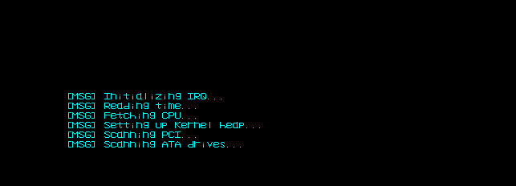
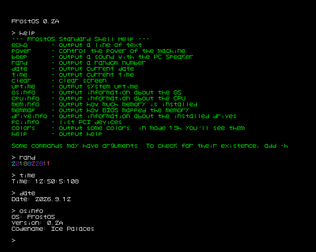

FrostOS
---

<p align="center">
  
  
  
</p>

> [!warning]
> I AM NOT RESPONSIBLE IF ANYTHING WILL HAPPEN WITH YOUR DEVICE. THERE SHALL
> BE NO EXPECTATIONS THE SYSTEM WOULD WORK PERFECTLY ON ANY MACHINE.

A hobby 32-bit OS made for self-learning from scratch.

## What it can do:
- display text and/or draw pixels via VGA/VBE Framebuffer
- read raw data from disks via ATA. (Tested only on QEMU, though seems to work on an old motherboard too...)
- reboot
- take input from keyboard, now with CTRL, SHIFT, ALT full support :D
- make sound with a PC speaker
- get time and date (NO UTC SUPPORT)
- detect PCI devices
- ACPI detection
- KERCALLS via `int 0x99` - a fancy way to say kernel-calls

## Constraints:
- This OS will be 32-bit forever... ###### probably.
- No paging, only segmentation and/or ASAN when needed.
- Every release that is being uploaded should atleast display info on screen,
take input from keyboard, and output sound via PC Speaker.

## Targets for next release or What to probably expect:
- More proper disk support.
- ###### Bootloader????

## Building an ISO:
```sh
make iso
```

## Running in QEMU:
You need to create the disk image so QEMU won't complain:
```sh
make disk
```

```sh
make run
```

Or the debug version:
```sh
make debug
```

## System API:
[click](https://github.com/ilonic23/FrostOS/blob/dev/docs/KERCALL.md)
